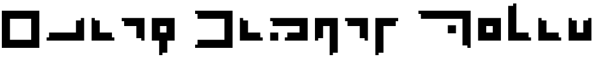
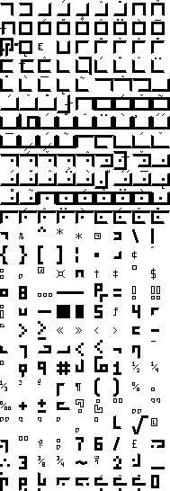

# Elian Bitmap Serif

This is a serif, bitmap font for the [Elian script](https://ccelian.com/ElianScriptFull.html), a pigpen-style cypher and calligraphic hand for English. You can see it live in use [on this demonstration webpage](https://benlk.github.io/elian-bitmap-serif/).

The font is made using [YellowAfterlife's Pixel Font Converter webapp](https://yellowafterlife.itch.io/pixelfont), which converts [`tileset.png`](./tileset.png) and [`character-list.txt`](./character-list.txt) into a TrueType Font. `tileset.png` is made by combining all the images in [the `glyphs/` directory](./glyphs/), and `character-list.txt` is made by cross-referencing glyph filenames with the [Adobe Glyph List for New Fonts](https://github.com/adobe-type-tools/agl-aglfn).

This font is licensed under the [SIL Open Font License 1.1](https://spdx.org/licenses/OFL-1.1.html), which affords you certain rights.

# How to use this font

**Desktop**: Download [Elian Bitmap Serif.ttf](./Elian Bitmap Serif.ttf) and install it on your computer using whatever means is appropriate for your program or operating system. Subscribe to this repo for updates.

**Web**: If you use git submodules or subtrees, you could include this repo in your repo for ease of updating it later. (Maybe you don't want to; it contains an Adobe repo as a submodule.) This project is still a work in progress. Then, use it in your project's CSS like so:

```css
@font-face {
	font-family: "Elian Bitmap Serif";
	src: url('./Elian Bitmap Serif.ttf')
	;
	font-weight: normal;
}
.ebs {
	font-family: "Elian Bitmap Serif", sans-serif;
}
```

To see the font in use, [see the demonstration page](https://benlk.github.io/elian-bitmap-serif/)!

## How to contribute

See [CONTRIBUTING.md](./CONTRIBUTING.md)

## Development notes

Goals:

- [x] Elian uppercase
- [x] elian lowercase
- [x] imagemagick [montage](https://www.imagemagick.org/Usage/montage/) command to assemble individual images into a grid
- [x] and output a text file for the use of https://yal.cc/r/20/pixelfont/
	- [x] based on filenames
	- [x] through lookup table
- [x] make sure mogrify and php have same sort order
	- bash globbing goes a A b B comma c C d D
	- php scandir goes A B C D a b c comma d
- [x] numbers
- [x] apply serifs to uppercase
- [x] ampersand
- [x] Github repo
- [x] apply serifs to lowercase
- [ ] accents/ligatures for lowercase
- [ ] "
- [ ] interpunct
- [ ] cedilla
- [ ] full punctuation (4px basis, hollow)
- [ ] cover full Windows-1252 plane, except:
	- thorn
	- German SS/ss
	- eth
	- fi/ffi and similar ligatures


Thanks to the following sources:
- https://yal.cc/r/20/pixelfont/
- https://silnrsi.github.io/FDBP/en-US/Characters_and_Glyphs.html
- https://scriptsource.org/cms/scripts/page.php?item_id=entry_detail&uid=gg5wm9hhd3
- https://github.com/adobe-type-tools/agl-aglfn/blob/master/aglfn.txt


